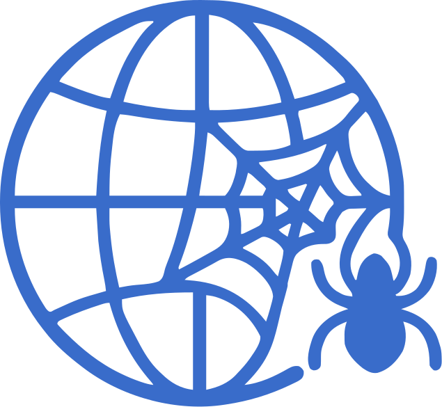

 # WebWeaving 
 
Welcome to **WebWeaving** – my personal portfolio website project! To Showcase my Developement and Designing Skills. This is an ongoing project where I am learning and implementing **Modern 3d & Gamified** Portfolio Project.

 
 

---

## Project Overview
WebWeaving is a **responsive** portfolio website showcasing my skills, projects, and experiences. The Whole Website tells a story and in the end there is a code to decode like Cicada 3301 

### 
Process 
  

**Module 1**

- **HTML** – Structuring the content.
- **SASS** – Styling the Webpage.
- **JavaScript** – Adding interactivity & Responsiveness.

**Module 2**

- **React.js** – For better component-based development.
- **Three.js** – To integrate 3D elements and Finalizing the animations.

**Module 3**

- Hosting & Deployment

## Get in Touch
Feel free to explore, suggest improvements, or contribute!   
Let's **weave** the web together! 

## Rough Plans - 

 

